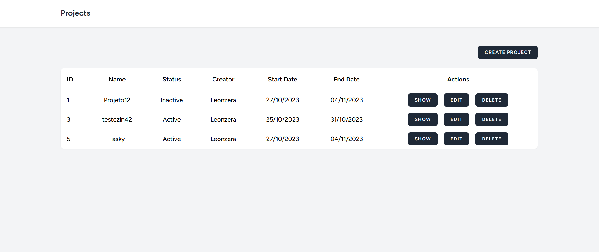
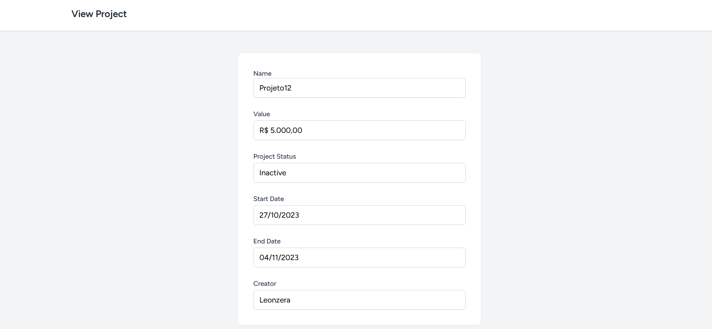

# Tasky

## About Tasky

Tasky is a web project management system that allows you to maintain and take control of your projects. 

Tasky is build with the power of Laravel in the backend, VueJS in the frontend and InertiaJS like a glue between them, providing a robust and user-friendly application.

## Tasky uses this techs

- Laravel
- InertiaJS
- VueJs
- MySQL

## How to run?

- cp env.example .env
- composer install
- php artisan key:generate
- php artisan migrate
- npm install && npm run dev

